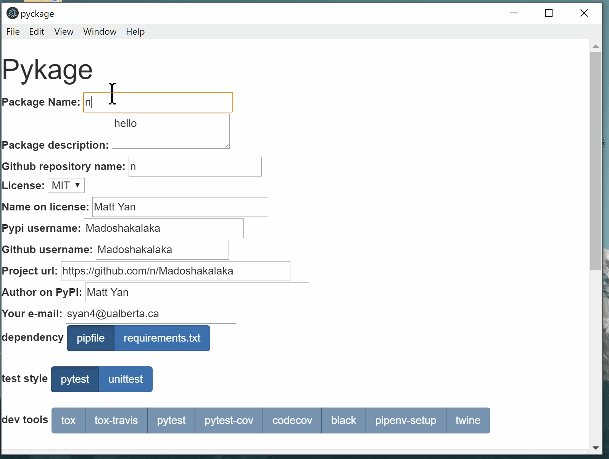

# Pykage

Pykage creates a perfect python package project with high configurability.

## Install
Download release for Mac, Windows, and Ubuntu [here](https://github.com/Madoshakalaka/pykage/releases)

## Features

The generated project features:
- filled `setup.py`
- `.travis.yml` that enables automatic testing on chosen python versions and os
- `.travis.yml` that enables automatic pypi release upon tagged github commit
- You favorite dev tools (pytest, tox, black ...)
- detailed instructions, function stubs and comments

The tool also remembers your profile and saves you time from keying in the same thing over and over again. 




## Highly Configurable


The basic project structure it creates:

```
packagename/
├── LICENSE
├── readme_assets
├── README.md
├── requirements.txt
├── setup.py
├── .travis.yml
├── tests
│   ├── data
│   ├── __init__.py
│   └── main_test.py
└── packagename
    ├── __init__.py
    └── main.py

```

Check this [pyckage-example-project](https://github.com/Madoshakalaka/pyckage-example-project) repo to see what an example it generates.
